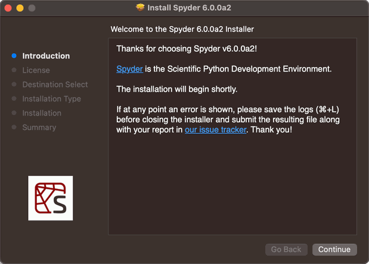
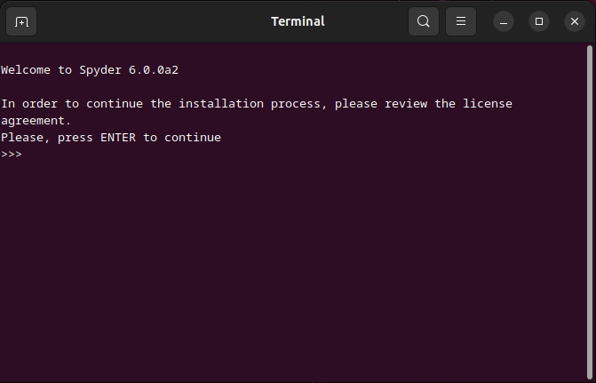

For the last several years, Spyder has offered standalone installers for Windows and macOS which isolate Spyder's runtime environment from users' development environments.
This provides a more stable user experience than traditional conda or pip installation methods.
However, these standalone installers did not allow implementing desirable features, such as automatic incremental updates or installing external Spyder plugins like Spyder-Notebook and Spyder-Unittest.
Additionally, these standalone applications were limited to Windows and macOS.

Our new installers will provide a more consistent experience for users across all platforms, including Linux, while maintaining the benefits of an isolated runtime environment for Spyder.
Additionally, they are fully compatible with incremental updates and external plugin management.
Look for future announcements about these and other features!

So, what will you see with these new installers?
If you are a Windows user, you will continue to have a graphical interface guiding you through the installation process, and will likely not notice any difference from the previous experience.

If you are a macOS user, you will now have a `.pkg` package installer instead of a `.dmg` disk image.
Rather than drag-and-drop the application to the `Applications` folder, the `.pkg` installer provides a graphical interface that will guide you through the installation process with more flexibility.

If you are a Linux user, you will have an interactive shell script guiding you through the installation process.
This ensures it is compatible with as many distributions and desktop environments as possible.

In all cases, you will not need to have Anaconda installed, nor do you need an existing Python environment; in fact, you don't even need a preexisting Python installation!
These installers are completely self-contained.
Spyder will continue to include popular packages such as NumPy, SciPy, Pandas and Matplotlib so you can start coding out-of-the-box.
However, you will still be able to use Spyder with your existing conda, venv, Python.org, and other Python installers and environments as before.
Furthermore, only Spyder and its critical dependencies will be updated on each new release, which will make getting the latest version a lean and frictionless process.

The Spyder team is really excited about these new installers and the new features they will make possible, and we hope you enjoy them too!
