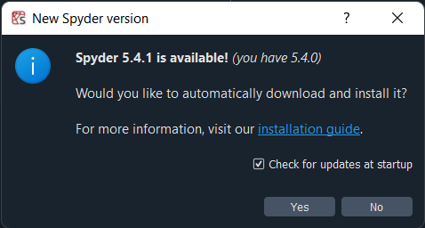
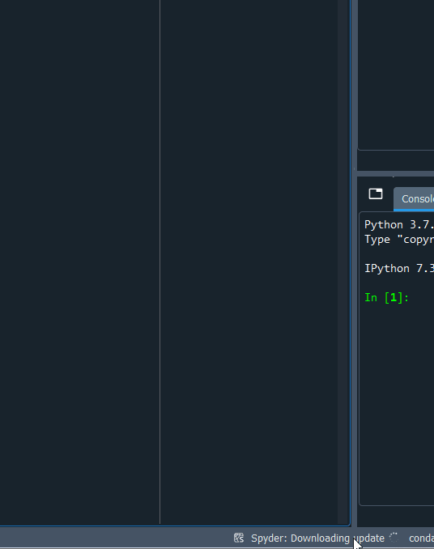
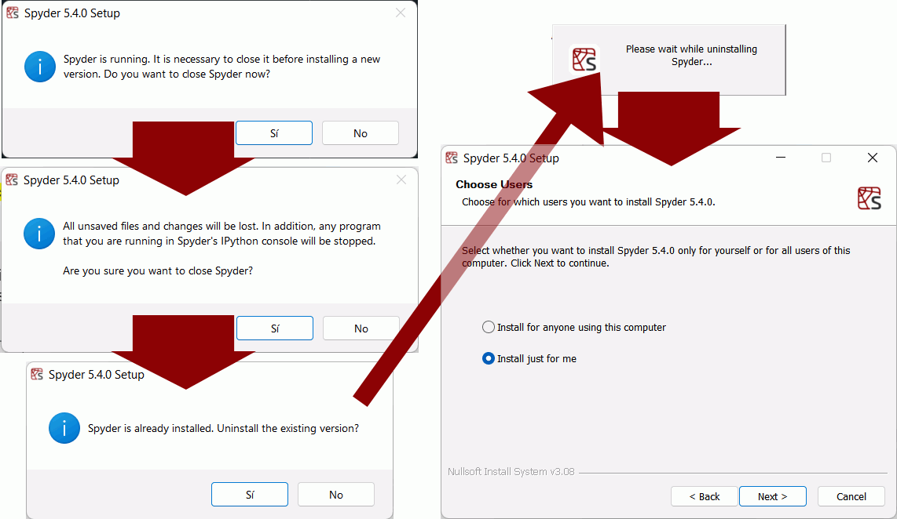

_[Juan Sebastian Bautista](https://github.com/jsbautista), [C.A.M. Gerlach](https://github.com/CAM-Gerlach) and [Carlos Cordoba](https://github.com/ccordoba12) also contributed to this post._

[Spyder 5.4.0](https://github.com/spyder-ide/spyder/releases/tag/v5.4.0) was released recently, featuring some major enhancements to its Windows and macOS standalone installers.
You'll now get more detailed feedback when new versions are available, and you can download and start the update to them from right within Spyder, instead of having to install them manually.
In this post, we'll go over how these new update features work and how you can start using them!

Before proceeding, we want to acknowledge that this work was made possible by [a Small Development Grant](https://github.com/spyder-ide/spyder/wiki/NumFOCUS-Small-Development-Grant-2022) awarded to Spyder by [NumFOCUS](https://numfocus.org/), which has enabled us to hire a new developer ([Juan Sebastian Bautista Rojas](https://github.com/jsbautista)) to be in charge of all the implementation details.

Before these improvements, Spyder already had a mechanism to detect more recent versions, but that functionality was very simple.
There was a pop-up dialog warning that a new version was available, but users had to follow a link to manually download the installer and then run it themselves:

Once you upgrade to Spyder 5.4.0 or above, you'll get this message on future Spyder updates:

Spyder will now be able to automatically download and install a new version for you, much like many other popular applications.

After clicking "Yes" on that dialog, Spyder will display another with the status and percent completion of the download.

If it is closed, the download will continue in the background, with its progress shown in a new status bar widget.

After the download completes, Spyder will ask if you want to update immediately, cancel the update or defer it to when you close Spyder, to avoid interrupting your current workflow.

If you chose to update immediately, or once you close Spyder if you deferred the update, our installer will be started automatically.
On Windows, the installer has a series of automated prompts to close the current instance, uninstall the previous version and finally install the new one:

On macOS, Spyder will automatically mount the new version's DMG, so you can simply drag and drop it in the Applications folder

We hope these improvements will make updating to future Spyder versions smoother and more straightforward, so we can bring you new features and enhancements more easily in the future!
