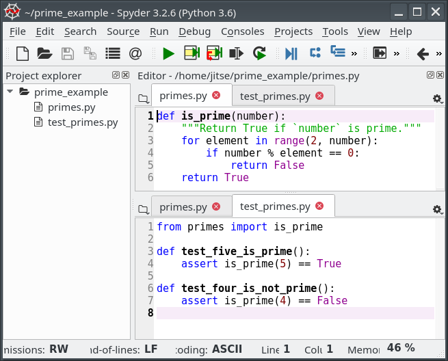
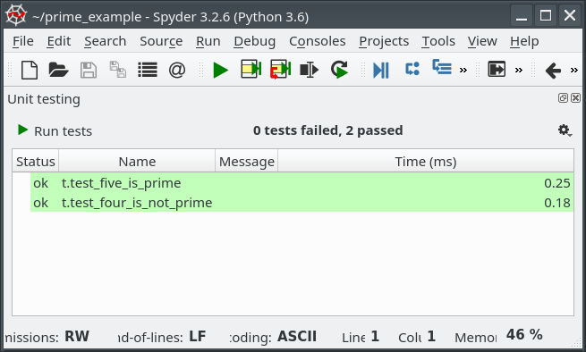
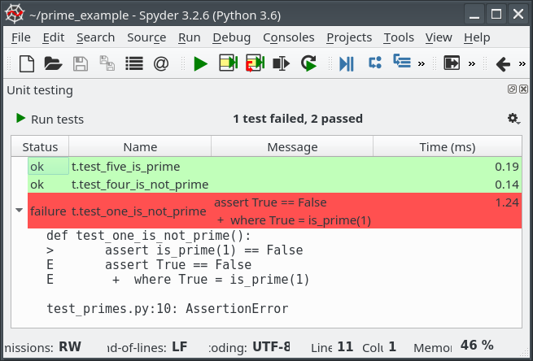

Automatic testing can increase the quality of your code. This is especially true of dynamic languages like Python, where a typo may only be noticed when that particular code path is executed. The new [Spyder unittest plugin](https://github.com/spyder-ide/spyder-unittest) lets you run tests and view the results, all within the IDE. Here, I'll demonstrate what it can do by way of a real-world example.

There are numerous unit testing frameworks available for Python, of which the plugin supports several of the most prominent. However, I'm using my favorite here, [pytest](https://pytest.org/). I prefer to write the tests in a separate file from the code, so that's what I'll do here.
## Installing the plugin
If you use the Anaconda distribution (as we recommend), then you can install the Spyder unittest plugin with the command

```bash
conda install -c spyder-ide spyder-unittest
```

This will also grab all its mandatory dependencies (including Spyder itself if necessary). The `-c` option instructs `conda` to use the custom channel `spyder-ide` run by the Spyder developers, since the plugin isn't part of the default channel.

Since we will be using the `pytest` framework, you also need to install it:

```bash
conda install pytest
```

We'll be running Python 3.6.4, Spyder 3.2.6, `spyder-unittest` 0.3.0 and `pytest` 3.3.2 for this example.


## Creating a project
I'll be using separate files for the tests and the code to be tested, so let's start by creating a project which will contain these files. In the `Projects` menu, click on `New Project ...`. Enter a name for the project (in my example, `prime_example`), and under `Location`, select the directory in which to store it. Click `Create`.


## Writing code to be tested
Create a Python file `primes.py` with the following function, which checks whether a number is prime:

```python
def is_prime(number):
    """Return True if `number` is prime."""
    for element in range(2, number):
        if number % element == 0:
            return False
    return True
```

This example is taken from the blog post [Improve Your Python: Understanding Unit Testing](https://jeffknupp.com/blog/2013/12/09/improve-your-python-understanding-unit-testing/) by Jeff Knupp.


## Writing the tests
To test our `is_prime` function, we will write two tests: one to check that `5` is considered a prime, and one to ensure `4` is not. They can be implemented as follows:

```python
from primes import is_prime

def test_five_is_prime():
    assert is_prime(5) == True

def test_four_is_not_prime():
    assert is_prime(4) == False
```

One of the cool things about `pytest` is that it can find the tests automatically, so you don't need to mark them in any way. By default `pytest` uses a naming convention: all functions starting with `test_` in files starting with `test_` are considered test functions. We'll save the code in the file `test_primes.py` which follows this naming convention.

In Spyder, the project now looks as follows:




## Running the tests

Now comes the fun part, where we actually get to use the plugin. In the `Run` menu, select `Run unit tests`. If you do not see this menu item, then the plugin is not installed; refer to the installation instructions above.

A window appears in which to configure the test run. One of the advantages of using a project is that it is automatically selected as the directory in which to find tests (another advantage is that Spyder will remember the testing configuration). So the only thing we need to do is select the test framework, which is `pytest`.


Press the `OK` button to run the tests, and lo and behold, the results appear in a new pane called "Unit testing":



As you can see, both tests pass. This means that our function correctly identifies `5` as prime and `4` as not prime.

## A failing test

Unfortunately, our function `is_prime` has a bug. The number `1` is not considered a prime, but `is_prime(1)` in fact returns `True`. Therefore, to test for this, we add the following code to `test_primes.py`:

```python
def test_one_is_not_prime():
    assert is_prime(1) == False
```

Now, run the tests again by clicking on `Run unit tests` in the `Run` menu. Spyder remembers the configuration so you are not asked for it again. This time, the results are:



Our new test fails. The details clarify that `is_prime(1)` returns `True`, while the assert in the test function claims that it should return `False`.


## Where to go from here

With this demonstration under your belt, you should be able to write tests for your code and run them with the plugin. For example, try fixing the bug so that `1` is correctly identified as non-prime, and run the tests again to check verify it.

`Spyder-unittest` supports not only the `pytest` framework, but also the `nose` framework and the `unittest` module in the Python standard library. It is still fairly new (as its version number suggests), so I look forward to your comments. Please send your ideas, bug reports and pull requests to the [spyder-unittest](https://github.com/spyder-ide/spyder-unittest) repo on Github.

Happy Spydering with automatic tests!
