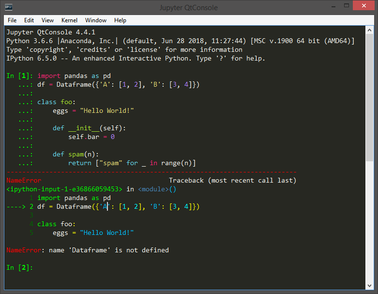

We're excited to announce a significant update to [QtConsole](https://qtconsole.readthedocs.io/en/stable/)—the package that powers Spyder's [IPython Console](https://docs.spyder-ide.org/ipythonconsole.html) interface—which the Spyder team maintains in collaboration with [Project Jupyter](https://jupyter.org/).
Two of the biggest changes—user-selectable syntax highlighting themes, and enhanced external editor/IDE integration—are already built right into Spyder, so they'll likely be of more interest if you use QtConsole standalone or with another editor/IDE.
However, most of the other changes should prove quite useful within Spyder as well, and many were in fact suggested and even implemented by users of our IDE.
Particular highlights include a block indent/unindent feature, Select-All (``Ctrl-Shift-A``) being made cell-specific, ``Ctrl-Backspace`` and ``Ctrl-Delete`` behaving more intelligently across whitespace and line boundaries, ``Ctrl-D`` allowing you to easily exit ``ipdb``, ``input()`` and the like, and numerous smaller enhancements and bug fixes.
If you'd like to learn more about what's new, please check out [our article](https://blog.jupyter.org/jupyter-qtconsole-4-4-81f2eaad5706) over on the [Jupyter blog](https://blog.jupyter.org/), where we go over the major changes in more detail, with plenty of screenshots and GIFs to illustrate each feature and how to use it.

To update to the newest version with your existing Spyder install, open an Anaconda Prompt (Windows), Terminal (macOS) or command line (Linux), activate the ``conda`` environment or ``virtualenv``/``venv`` of the Spyder install you are using, and run ``conda update qtconsole`` (or ``pip install --upgrade qtconsole``, if not using Anaconda).
If you'd like to try QtConsole out separate from Spyder or integrate it in with your own editor or IDE, it is also available as a standalone GUI by running ``jupyter qtconsole`` from the Python environment where it or Spyder is installed.

If you have any questions, problems or feedback, we'd love to hear from you. Report issues, request features or participate in QtConsole's development at its [Github site](https://github.com/jupyter/qtconsole), and check out its [documentation](https://qtconsole.readthedocs.io/en/stable/) for help using it.
For the latest Spyder news, releases, previews and tips, you can follow our [Facebook](https://www.facebook.com/SpyderIDE/) and [Twitter](https://twitter.com/spyder_ide), and help support the development on Spyder and its sister projects like QtConsole on [OpenCollective](https://opencollective.com/spyder).

Our new documentation and Spyder 4 beta 1 have been fully live for some time now; given the dramatic scale of the changes in both, their respective blog posts are still in the works.
We'll also have an upcoming article on our official Spyder 4 feature roadmap and more, and Spyder 3.3.2 is due out soon, so keep in right here for your Spyder fix!
Until then, happy Spydering and enjoy QtConsole 4.4!
