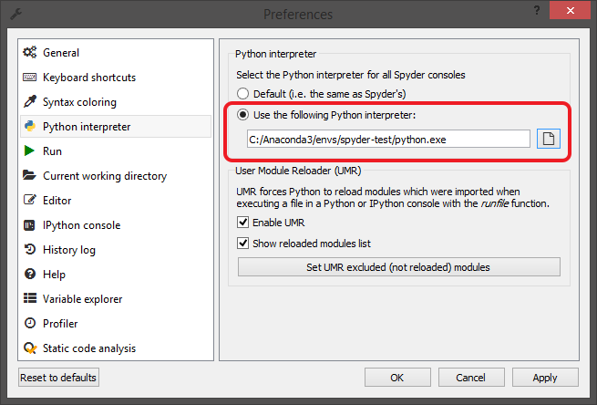
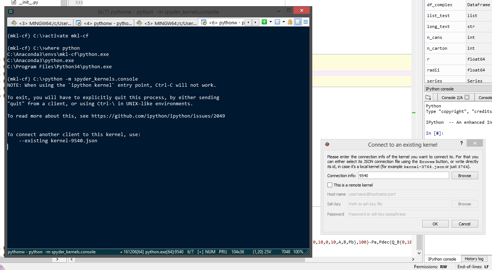
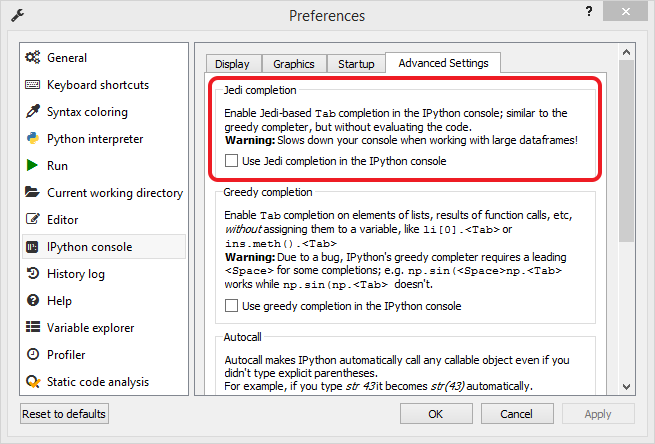
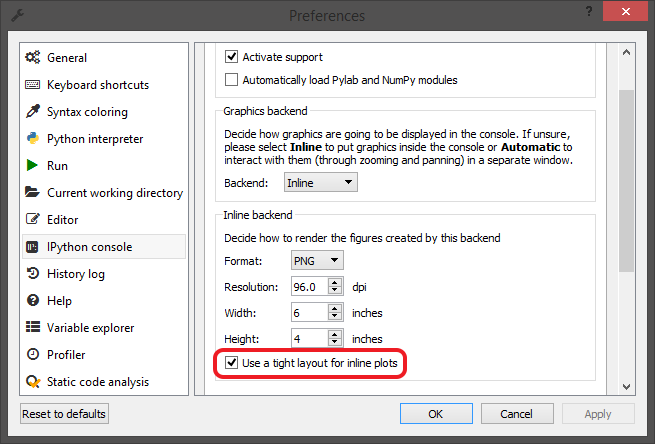
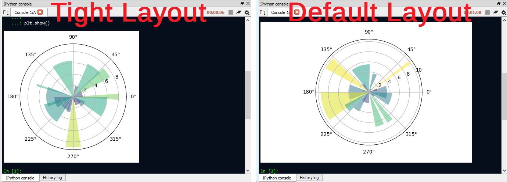
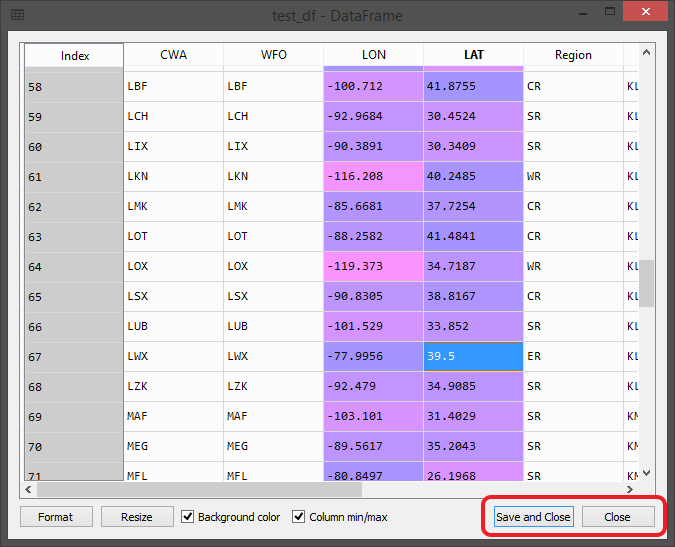
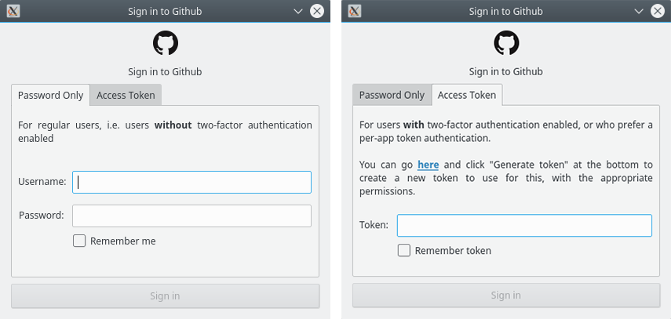
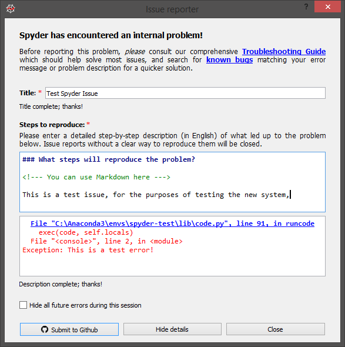

We're pleased to release the next significant update in the stable Spyder 3 line, 3.3.0, along with its follow-on bugfix point release, 3.3.1, which is now live on PyPI and ``conda``.
As always, you can update with ``conda update spyder`` in the Anaconda Prompt/Terminal/command line (on Windows/macOS/Linux, respectively) if on Anaconda (recommended), or ``pip update spyder`` otherwise.
If you run into any trouble, please carefully read our [new installation documentation](https://docs.spyder-ide.org/installation.html) and consult our [Troubleshooting Guide](https://github.com/spyder-ide/spyder/wiki/Troubleshooting-Guide-and-FAQ), which contains straightforward solutions to the vast majority of install-related issues users have reported.

As a new minor version (3.3), it makes several substantial changes to Spyder's underpinnings that deserve some explanation, particularly the newly modular and portable console system that's now separated into its own ``spyder-kernels`` package, opening up several new options for users running Spyder in different environments.
There's also a brand-new error reporting process, new options in the IPython console, usability and performance improvements for the Variable Explorer, multiple new and changed dependency requirements and more, so there's plenty to go over.
Finally, we'd like to briefly share a few final notes on this release and the latest on our plans going forward.


## Modular, flexible Console architecture

The biggest single change with version 3.3.0/3.3.1 is a major overhaul of how IPython Consoles are started and managed in Spyder.
More precisely, we've moved all the kernel-related code from the Spyder core into a new modular package, ``spyder-kernels``, available on the [same](https://github.com/spyder-ide/spyder-kernels) [distribution](https://pypi.org/project/spyder-kernels/) [channels](https://anaconda.org/conda-forge/spyder-kernels) as Spyder itself (and installed automatically when updating to >=3.3.0).
While the most dramatic differences are under the hood, there's plenty for everyone to like (and a few things to be aware of).

Most importantly, for our everyday users, this makes Spyder much more flexible and powerful when working with multiple Python environments.
With the changes, Spyder itself does not need to be present in every environment you'd like to launch a kernel in; you can install the full IDE in whatever manner you prefer, and then set it to run code and consoles in any Anaconda environment, ``virtualenv``/``venv``, or even a totally separate Python installation, so long as it has ``spyder-kernels`` package available.
Just set the path under ``Tools -> Preferences -> Python interpreter -> Use the following Python interpreter`` to the desired Python executable, and any new Console you open will start in the selected environment.
Check out our [new wiki page on using environments with Spyder](https://github.com/spyder-ide/spyder/wiki/Working-with-packages-and-environments-in-Spyder), for more details and tips on the subject, and keep an eye out for the further improvements coming in Spyder 4, which will greatly simplify the process and include full GUI-based project, package and environment management functionality built right in.



Furthermore, the new package allows you to independently launch a kernel from anywhere (on your local computer, or a remote machine, server or even supercomputing cluster), connect to it with Spyder, and use it just like a "natively" started one.
After installing ``spyder-kernels`` on the host environment, you can start one with ``python -m spyder_kernels.console``, and then enter the kernel's 4-digit ID (and SSH connection details, if a remote machine) in the Spyder ``Connect to an existing kernel`` dialog under the IPython Console pane context- or "gear"-menu).
For more information on the process, see the [Connecting to a Console](https://docs.spyder-ide.org/ipythonconsole.html#connecting-to-a-console) section in our new documentation.



Best of all, no matter how or where a kernel is started, every console now supports the full suite of Spyder's features, including completion, the Variable Explorer, interactive Help and more, unlike before.
You can even mix and match internal, external and remote kernels in different environments, all in the same Spyder session, by either changing the Python interpreter preferences setting between starting a console, or starting and connecting to multiple consoles externally—or both!
Finally, for those of us (and those of you!) who help develop Spyder, the changes also make it easier to maintain and improve the code, and opens the door to one of the biggest features coming in Spyder 4: a new, full-featured debugging kernel that many of you have been asking for.

The one key thing to remember: make sure you install the appropriate version of ``spyder-kernels`` for your version of Spyder. For most users, that will be spyder-kernels 0.x (currently 0.2.6) to match Spyder 3 on our stable ``3.x`` branch; if testing a Spyder 4 beta or Github clone of the ``master`` branch, you'll want the latest 1.x version of ``spyder-kernels`` (currently 1.1.0).
To install the correct build, you can use the following ``conda`` command,

```bash
conda install spyder-kernels=<0 or 1>.*
```

or with ``pip``,

```bash
pip install spyder-kernels==<0 or 1>.*
```

replacing ``<0 or 1>`` with the major version number (0 or 1) to match your Spyder version.
Further details specific to installing a development build can be found in our [Contributing Guide](https://github.com/spyder-ide/spyder/blob/master/CONTRIBUTING.md#using-the-correct-version-of-spyder-kernels) or our [install documentation](https://docs.spyder-ide.org/installation.html#installing-a-development-build).


## New IPython Console completion and plotting features



Spyder's IPython Consoles can now use an advanced ``jedi``-based completion engine that, similar to the Editor, analyzes your code without actually having to run it first.
This allows for advanced completion functionality on objects not yet assigned to a variable, similar to the existing "greedy" completion option, but without the need for dynamic evaluation.
It can be slow if working with very large Pandas ``DataFrames`` so it is disabled by default, but you can activate it under ``Tools -> Preferences -> IPython console -> Advanced Settings -> Jedi completion``.
The descriptive text for the "greedy" completion option (also off by default) was also clarified, particularly to explain an IPython bug (not present in the ``jedi`` completer) with the feature and a consequent workaround.



We've also added a new plotting setting, ``Use a tight layout for inline plots``, for the ``Inline`` Matplotlib graphics backend.
The default behavior (as in previous Spyder versions) sets ``bbox_inches`` to ``"tight"`` in Matplotlib calls when drawing to the inline backend.
However, if you prefer your own ``bbox_inches`` argument be respected even when plots are rendered in the Console, you can now do so by unchecking this option under ``Tools -> Preferences -> IPython console -> Graphics -> Inline backend``.




## Better Variable Explorer usability and performance

We've made several changes and optimizations to greatly improve performance and efficiency in the Variable Explorer, to make it much faster and use less memory when opening and editing large objects.
In particular, we've fixed several major memory leaks when saving edited objects and closing the Variable Explorer dialogs through better length validation and garbage collection, and now skip the whole saving process entirely if the object was not modified (or cannot be modified).
We've also changed the names and functions of the ``Cancel`` and ``Ok`` buttons in Variable Explorer dialogs to be easier to understand and use.
They now feature a ``Close`` button which exits the dialog without saving any edits to the object's contents, and a ``Save and Close`` button—automatically enabled once modifications are made—that commits the changes back to the kernel.




## Streamlined error reporting experience

While we hope you never need to use it, Spyder 3.3.0 includes a brand-new error handling backend that can submit bug reports directly through the Github API.
Based off [Colin Duquesnoy](https://github.com/ColinDuquesnoy)'s excellent [QCrash](https://github.com/ColinDuquesnoy/QCrash) framework, this is a major improvement in speed, functionality, reliability and user convenience over the old approach (essentially just opening a link in a web browser).
Just as before, we won't send anything without your explicit consent, you need a Github account (or create one for free), and you can view and edit the report on Github at any time.



You will need to enter your Github credentials the first time you submit a report.
For this, you can [create an app token](https://github.com/settings/tokens/new?scopes=public_repo) which only grants the very limited permissions needed to create a public issue report, can be easily revoked and re-created, and works with two-factor authentication (which you should be using); however, if you have not yet enabled 2FA, it also offers the option to enter your Github username and password.
Either way, Spyder can securely remember your login using the [``keyring``](https://github.com/jaraco/keyring) package, so you only have to do this once on any given machine (if you select the "remember" option).



The dialog itself has also been made more functional and user-friendly, designed to help encourage high-quality, useful reports, and with more accessible, descriptive text.
The reports themselves also contain more useful data about the problem, and there is now a ``--safe-mode`` command-line option for Spyder to start in a clean, temporary config directly, so you can test to see if the problem reoccurs without the hassle of a ``spyder --reset``, and play around with other settings without impacting your main configuration. Finally, we've fixed over 40 bugs in this release and further improved our documentation and troubleshooting material, so hopefully you'll see this less often.


## Cleaner under the hood and more

Alongside the aforementioned internal changes, we've also made a number of other under-the-hood changes to clean out old cruft and improve maintainability, readability and performance of our codebase.
In particular, we've officially dropped support for Python 3.3, PyQt4, and PyQt5 under 5.5, all versions which have been end-of-life for years, and (aside from PyQt4) have minimal or no remaining Spyder users.
Furthermore, dropping ``PyQt4`` in particular allows us to avoid or resolve a number of unfixable bugs specific to that version that have been causing problems for users, and opens the door to easier development in the future.
Finally, we moved our legacy documentation (and its many associated images) from the main Spyder codebase to [its own repo](https://github.com/spyder-ide/spyder-docs), executed a major overhaul to greatly modernize and expand the text, images, style, and presentation, and now deploy them onto [their own subdomain of our site](https://docs.spyder-ide.org/), all of which we will discuss in a separate post coming soon.


## Even more fixes and refinements with Spyder 3.3.1

As a quick follow-on to the 3.3.0 release, Spyder 3.3.1 fixed a handful of bugs and minor issues with the new functionality and cleaned up several other existing ones, as well made a number of lower-level maintenance and development-oriented changes—over two dozen in all.
Furthermore, several user-visible enhancements made it into the release, primary aimed at improving usability.
To make it easier for users to manage multiple environments, the selection UI under `Preferences > Python interpreter > Use the following Python interpreter` remembers the executables you've previously selected and allows quick switching between them.


In the Console, mundane ``ipdb`` commands are automatically filtered from the history, and the Editor now supports syntax highlighting for the [new numeric literal syntax](https://www.python.org/dev/peps/pep-0515/) introduced in Python 3.6.
Spyder's tutorial has been re-written for modern Spyder as well as to be clearer and more understandable, and overhauled for better and more consistent formatting and visuals with the rest of our documentation.
Finally, our update checker now consults the Anaconda ``defaults`` channel rather than PyPI to determine if an update is available, so it doesn't bug the majority of our users on Anaconda until they can actually acquire the package.


## What to know and what's next

If you have any questions, problems or feedback, we'd love to hear from you (just make sure you read our [documentation](https://docs.spyder-ide.org/), [Troubleshooting Guide](https://github.com/spyder-ide/spyder/wiki/Troubleshooting-Guide-and-FAQ) and the other previously-mentioned resources first)!
For general questions or install issues that aren't addressed by the above, our [Google Group](https://groups.google.com/group/spyderlib) and [Gitter live chat](https://gitter.im/spyder-ide/public) are a good place to ask, while [our Github](https://github.com/spyder-ide/spyder) is the place to report bugs, request features, or help develop Spyder itself (though make sure to search our [issues list](https://github.com/spyder-ide/spyder/issues?utf8=%E2%9C%93&q=is%3Aissue) to ensure it hasn't already been submitted).
Finally, you can follow our [Facebook](https://www.facebook.com/SpyderIDE/) and [Twitter](https://twitter.com/spyder_ide) for the latest Spyder news, releases, previews and tips, and help support Spyder development on [OpenCollective](https://opencollective.com/spyder).

There's plenty to look forward to in the coming days, with the official release of our all-new documentation (that's already live now), Spyder 4 beta 1 having just been released on PyPI, conda-forge and our own ``spyder-ide`` channel (with a blog post coming soon), an upcoming article on our official Spyder 4 feature roadmap and more, so stay tuned!
In the meantime, happy Spydering and enjoy the new 3.3.1!
