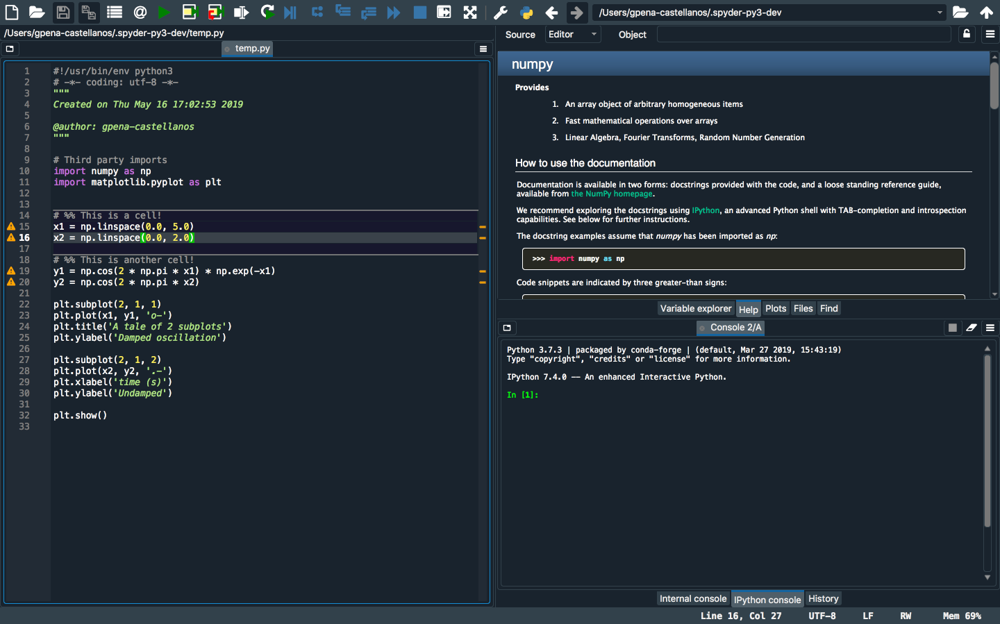
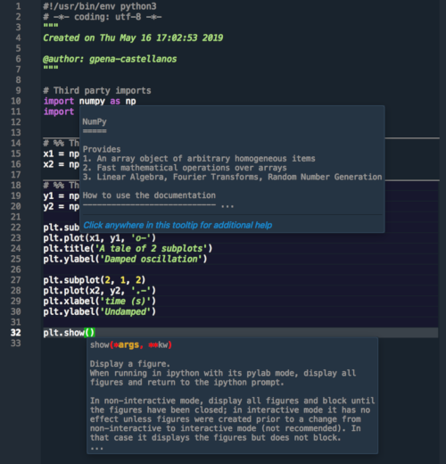
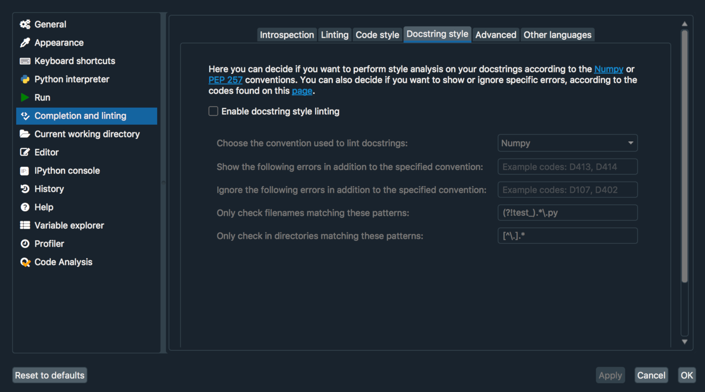
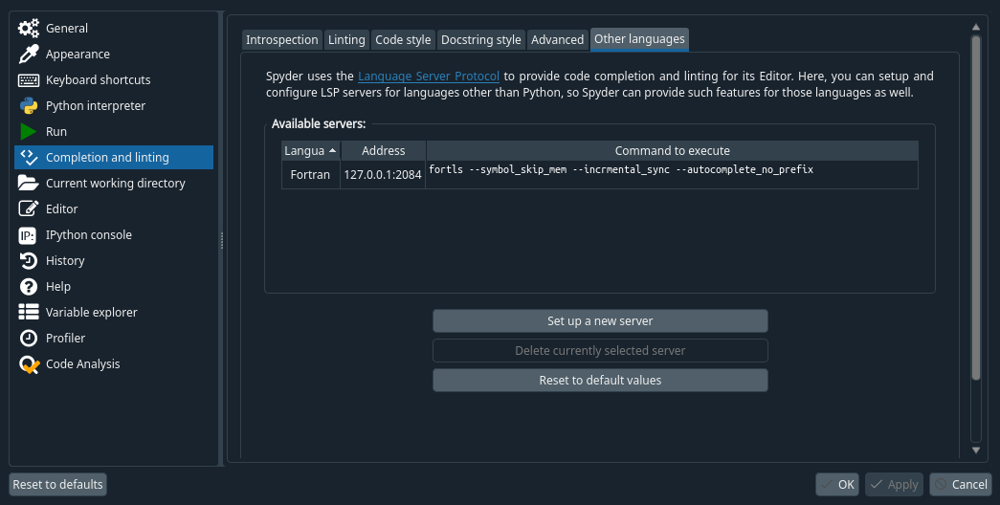
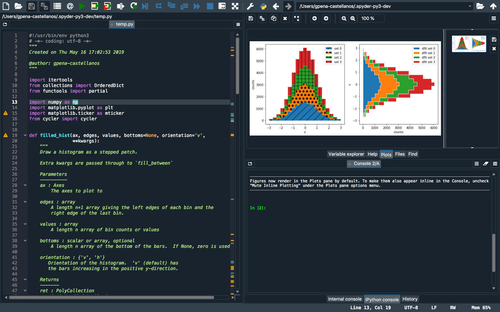

*This blogpost was originally published on the [Quansight Labs website](https://labs.quansight.org/)*

It has been almost two months since I joined Quansight in April, to start
working on Spyder maintenance and
development. So far, it has been a very exciting and rewarding journey under
the guidance of long time Spyder maintainer
[Carlos Córdoba](https://github.com/ccordoba12).
This is the first of a series of blog posts we will be writing to showcase
updates on the development of Spyder, new planned features and news on the
road to Spyder 4.0 and beyond.

First off, I would like to give a warm welcome to
[Edgar Margffoy](https://github.com/andfoy),
who recently joined Quansight and will be working with the Spyder team to
take its development even further. Edgar has been a core Spyder developer
for more than two years now, and we are very excited to have his (almost)
full-time commitment to the project.

# Spyder 4.0 Beta 2 released!

Since August 2018, when the first beta of the 4.x series was released, the
Spyder development team has been working hard on our next release.
Over the past year, we've implemented the long awaited full-interface dark theme;
overhauled our entire code completion and linting architecture to use the
[Language Server Protocol](https://microsoft.github.io/language-server-protocol/),
opening the door to supporting many other languages in the future;
added a new Plots pane to view and manage the figures generated by your code;
and numerous other feature enhancements, bug fixes and internal improvements.

## Dark theme

A full-interface dark theme has been a
[long awaited feature](https://github.com/spyder-ide/spyder/issues/2350),
and is enabled by default in Spyder 4. You can still select the
light theme under  ``Preferences > Appearance`` by either choosing a light-background
syntax-highlighting scheme, or changing ``Interface theme`` to ``Light``.



Pretty, right :-) ?

This enhancement was made possible by the work of
[Colin Duquesnoy](https://github.com/ColinDuquesnoy),
[Daniel Pizzeta](https://github.com/DPizzeta)
and their [QDarkStyle](https://github.com/ColinDuquesnoy/QDarkStyleSheet/)
package. The Spyder team is now actively collaborating with Colin and Daniel
to pursue the release of QDarkStyle 3.x, which will be using Spyder's
[QtSASS](https://github.com/spyder-ide/qtsass/)
package to harness the power of SASS/SCSS and allow users to fully customize
the theme dynamically.


## Language Server Protocol architecture

The Language Server Protocol (LSP) was created by Microsoft for Visual Studio Code to standardize how
development tools (e.g. editors and IDEs) communicate with
servers that provide code completion, linting and related facilities for
different programming languages. With LSP, as
[they describe it](https://microsoft.github.io/language-server-protocol/):

> A single Language Server can be reused in multiple development tools,
> which in turn can support multiple languages with minimal effort.
> LSP is a win for both language providers and tooling vendors!

As of Spyder 4 Beta 2, Spyder is now one of those tools!
We developed our own client to communicate with any server that implements
LSP v3.0 through a transport layer that uses ZeroMQ sockets. Code completion,
help generation, calltips, and real-time code/style analysis were rewritten to take advantage of this
architecture, and hover hints and docstring style analysis were added.
Further LSP features, such as workspace functionality and on the fly completion, will come in future betas.



Our current support is geared towards Python, using the great
[Python-Language-Server](https://github.com/palantir/python-language-server)
package. This has allowed us to provide fine-grained configurability for
[Pycodestyle](http://pycodestyle.pycqa.org/en/stable/) and
[Pydocstyle](http://www.pydocstyle.org/en/stable/) options, and in future
betas we’ll also add the ability to use and configure code formatters like
YAPF and autopep8.



We support configuring LSP servers for additional, non-Python programming languages.
In the future, we hope to include out-of-the-box LSP integration for
some of the most popular languages in the scientific computing space,
including Fortran, Julia and C/C++.



## Plots pane

Similar to [RStudio](https://www.rstudio.com/) and other data science IDEs,
Spyder now includes a Plots pane, allowing you to browse all figures created during a
session. Beyond just viewing plots, you can also zoom, save/export, copy and remove
them.



## But wait, there's more!

There are numerous additional features we've added in the previous 10
months! These include:

* **Autosave** and **File Recovery** in the editor, so Spyder can restore your
unsaved files in case it crashes or something else goes wrong.
* Dedicated **Sympy**, **Cython** and **Pylab** consoles, making it
very simple to quickly explore and create code for these libraries.
* OS level **window pane undocking**, allowing you to easily
organize panes across different monitors.
* Support for **[multi-indexes](https://pandas.pydata.org/pandas-docs/stable/user_guide/advanced.html)**
in our Dataframe viewer, making working with complex datasets much easier.

We will describe all of these additional enhancements in greater detail in
future blog posts.

## You can help!

If would like to help us test this beta release and try out the new features it offers,
you can! You can install it with ``conda`` (if using Anaconda/Miniconda, as we recommend),
or with ``pip``; we suggest doing so in a new Conda env or ``virtualenv``/``venv``
so you can easily switch between your existing Spyder install and the Spyder 4 beta.
For example, to do so with ``conda``, enter the following at the Terminal/Anaconda prompt:

```bash
$ conda create --channel spyder-ide --name spyder-beta spyder=4.0.0b2
$ conda activate spyder-beta
$ spyder
```

This is a safe process because Spyder now uses a different configuration
directory for its development versions, so you can easily switch between our stable
and beta releases without worrying about one affecting the other.

If you find any bugs, you can report them on our
[issue tracker](https://github.com/spyder-ide/spyder/issues);
make sure to search for your error message or behavior before making a new one.

## Closing remarks

I would like to thank Quansight for the opportunity of working in open source
development on an awesome project like Spyder. I am also grateful to our
users, [contributors](https://github.com/spyder-ide/spyder/graphs/contributors)
and [core developers](https://github.com/orgs/spyder-ide/people) for helping
making Spyder amazing!
